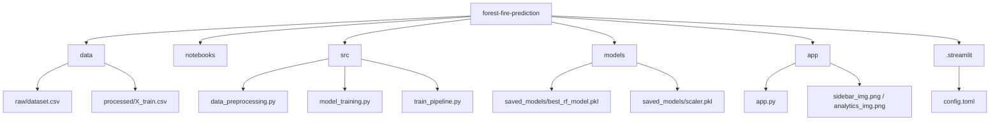

# 🔥 IgnisGuard: Advanced Forest Fire Intelligence

IgnisGuard is a production-grade machine learning application designed to predict and monitor forest fire risks using meteorological data and Fire Weather Indices (FWI). Trained on the Algerian Forest Fires dataset, the system leverages an ensemble Random Forest architecture to provide real-time, high-confidence risk assessments.

[](https://ignisguard-forest-fire-prediction.streamlit.app/)

---

## 🚀 Key Features

- **Predictive Analytics**: High-accuracy classification (96%+) of forest fire susceptibility.
- **Dynamic Dashboard**: Interactive interface for real-time risk assessment.
- **Glassmorphism UI**: Premium, modern design with a focused user experience.
- **Automated Pipeline**: End-to-end data processing from raw CSV to serialized model artifacts.
- **Robust Preprocessing**: Handles data skewness, multicollinearity, and geographical context.

## 🛠️ Technical Stack

- **Engine**: Python 
- **Framework**: Streamlit (Web UI)
- **Machine Learning**: Scikit-Learn (Random Forest Classifier)
- **Data Engineering**: Pandas, NumPy
- **Serialization**: Joblib (Model & Scaler persistence)
- **Design**: Vanilla CSS with Glassmorphism & Custom Brand Assets

## 📂 Project Structure



- **`data/`**: Storage for raw environmental data and processed engineering sets.
- **`notebooks/`**: Experimental research phase (EDA, Cleaning, and Model Selection).
- **`src/`**: Modularized core logic for preprocessing, training, and pipeline automation.
- **`models/`**: Production-ready serialized artifacts (Model & RobustScaler).
- **`app/`**: The frontend layer powered by Streamlit and custom brand assets.

## 📊 Model Performance

| Metric | Score |
| :--- | :--- |
| **Accuracy** | 96.2% |
| **Precision** | 96.4% |
| **Recall** | 96.4% |
| **F1-Score** | 96.4% |
| **ROC-AUC** | 0.994 |

## ⚙️ Installation & Usage

### 1. Clone & Setup
```bash
git clone https://github.com/DBMoktan/forest-fire-prediction.git
cd forest-fire-prediction
pip install -r requirements.txt
```

### 2. Run Training Pipeline
Synchronize the model with the latest data logic:
```bash
python src/train_pipeline.py
```
`
### 3. Launch IgnisGuard
```bash
streamlit run app/app.py
```

## 🌐 Deployment
This project is optimized for **Streamlit Cloud**. 
- **Repository**: GitHub
- **Main Path**: `app/app.py`
- **Configuration**: Automatically handled via `.streamlit/config.toml`

---
Developed with ❤️ by **DB Moktan** | Data Science & AI Engineering Research
